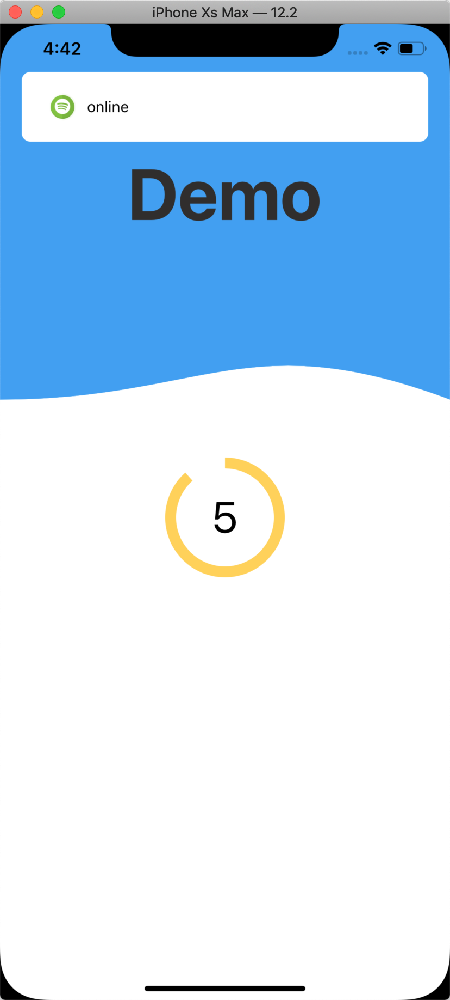
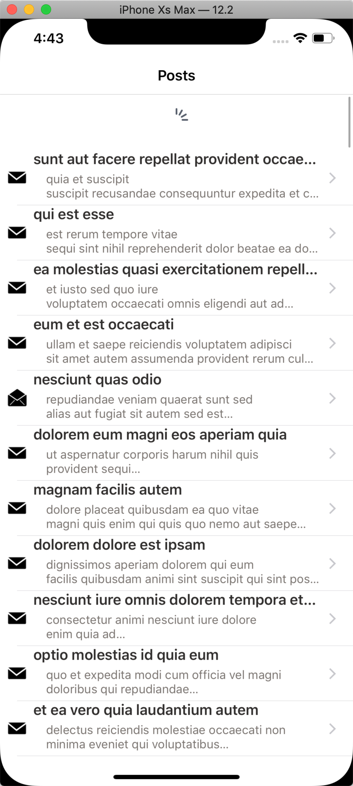
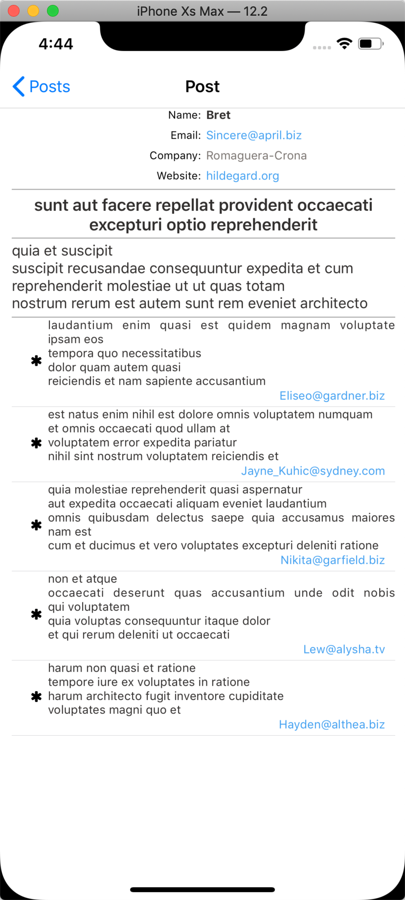

# PostsViewer

# 1. Installation 

* In order to install app please run ‘pod install’ first.  
* Use Workspace instead of project.

# 2. Run app.

* There is ‘Reachability’ pod which works more stable on real device.  On simulator it works once at start. 
There for automatic update of detailed page might be turned off when internet connection switched from off-line to online.

# 3. Features

* There are 3 screens:  splash(initial), list of posts and detailed post page.
	- ‘Splash’ screen implemented ONLY for demonstration purpose of animation experience. 
	- ‘List of posts’ presents table of posts with brief info of title and body.
	- ‘Detailed screen’ presents short user’s info, full post’s title and body and comments.

* ‘List of posts’ has icon on each table-cell, which shows ‘read’/‘unread’ status. Once you’ll open detailed post, this status would be changed.

* ‘Detailed screen’, in user area and comment-table has clickable fields for email and website. 
	Once you will click on ‘website’ field then Safary will be opened with appropriate page.
	(only on real device) If you would click on email then Mail client will be opened. 

* There is ’top banner alert view’ which will be showed on any screen if network connection changed.  
	But due to reachability issue it works stable on real device.

* Once posts fetched from server, they are save din local storage using realm. If internet off then cached data presented.

* ‘List of posts’ has refresh feature. If you’ll pull down table, it will try to re-download all data.

# 4. Tech Notes

* __MVVM__ approach used together with functional reactive programming as one of the most efficient and scalable strategy to build clear, testable architecture.

* For reactive approach, __ReactiveCocoa__ was used. 

* To make app testable and scalable, __Swinject__ and __SwinjectAutoregistration__ pods used. 

* To store data and use them offline __RealmSwift__ pod used. 

* To fetch data from server, __Alamofire-SwiftyJSON__ pod used and also __AlamofireObjectMapper__ which help to map received data to realm classes.

* For easy navigation between View Controller, __JLRoutes__ pod was used. It helps to focus navigation behavior in “navigation service” and reuse it all together.

* To have better code style, __SwiftLint__ is integrated. 

* Unit tests implemented to cover some part of app.  __OHHTTPStubs/Swift__ pod used to stub rest requests. __Nimble__ pod used to write clean tests.

* __SwiftyBeaver__ used to have clean and flexible to read logs.

 

 
